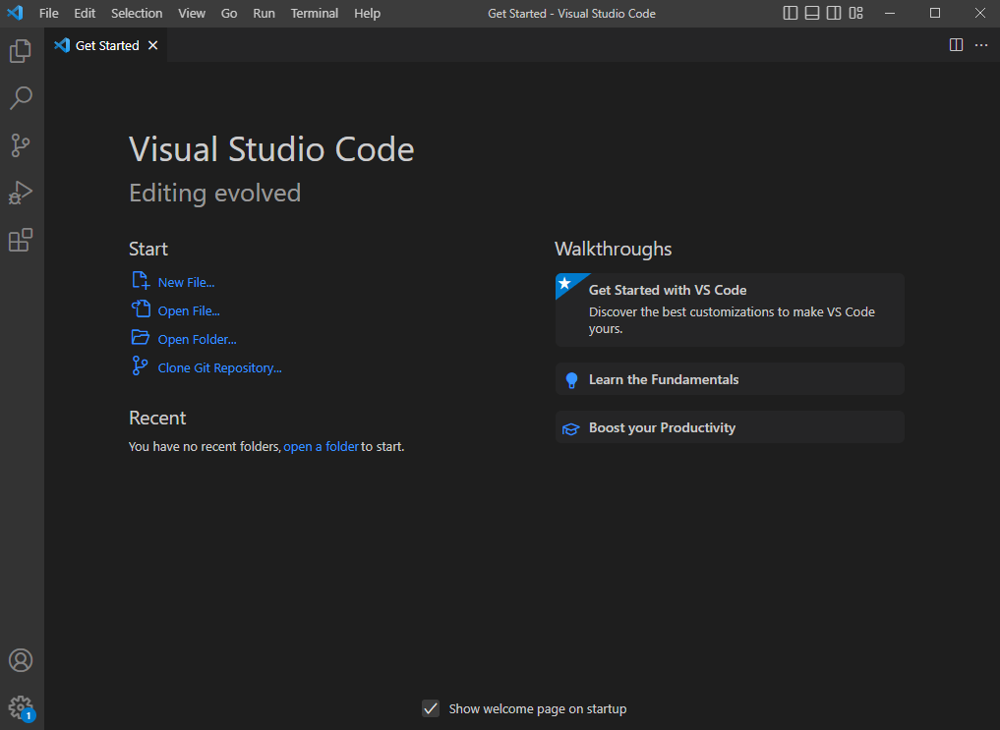

# STEP 1:  Visual Studio Code
1) Download Visual Studio Code from their website:  https://code.visualstudio.com/
2) the instructions will be different depending on your operating system
3) when intalled and opened, you should see this:

---
#STEP 2:  Remotely Connecting
1) Download Git if you're on Windows:  https://git-scm.com/
2) Open a terminal using Ctrl + `
