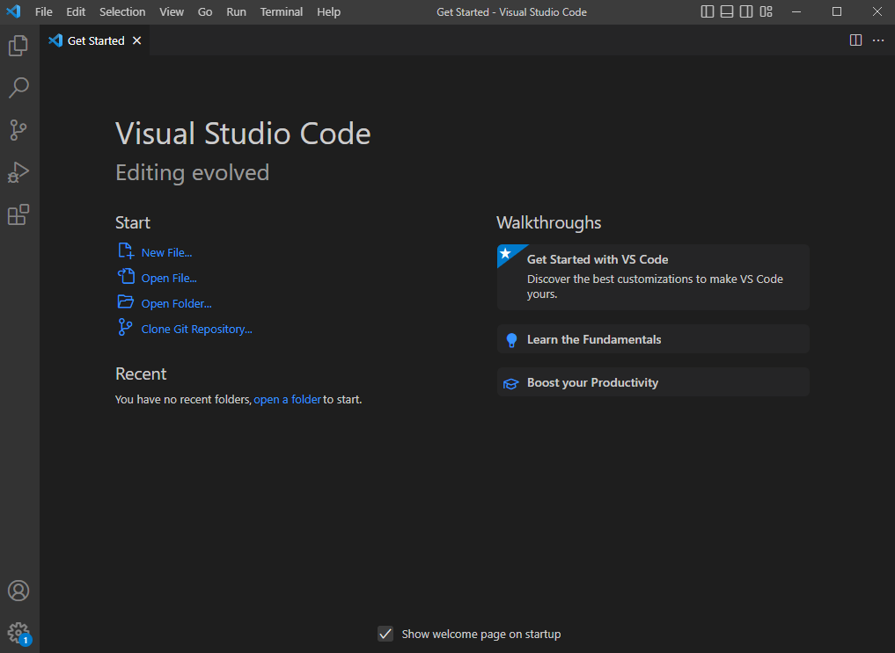
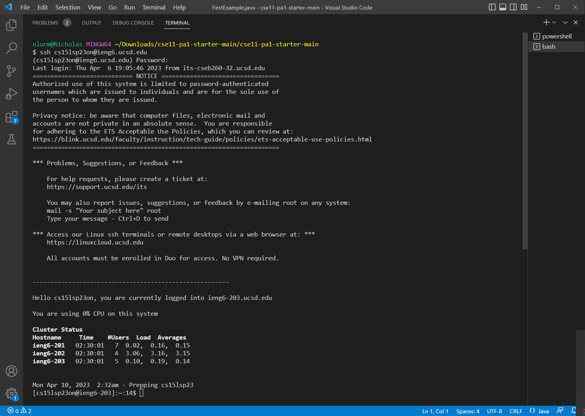
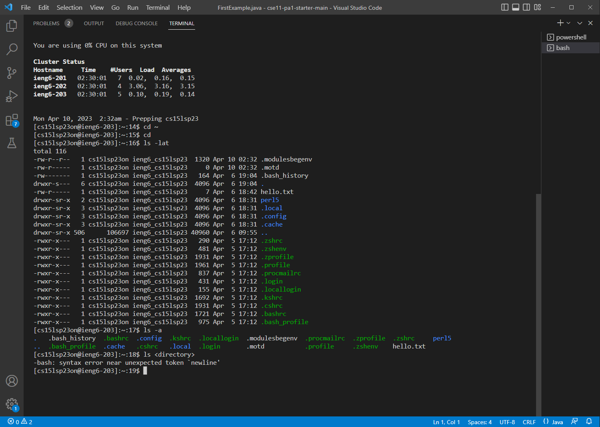

# STEP 1:  Visual Studio Code
1) Download Visual Studio Code from their website:  https://code.visualstudio.com/
2) The instructions will be different depending on your operating system
3) When intalled and opened, you should see this:

---
#STEP 2:  Remotely Connecting
1) Download Git if you're on Windows:  https://git-scm.com/
2) Open a terminal using Ctrl + `
3) Open the drop down menu in the top right of the terminal to use Git Bash
4) In the terminal enter ssh followed by your account username
5) When prompted for a password, enter your account password (understand that anything you type will not show up)
6) If asked to continue answer yes
7) your terminal should look like this:

---
#STEP 3:  Run Some Commands
1) you can now run commands on your remote computer after ssh-ing through the terminal
2) Some useful commands to know are:  cd, ls, pwd, mkdir, and cp
3) your terminal should look like this when running commands on your remote computer:

